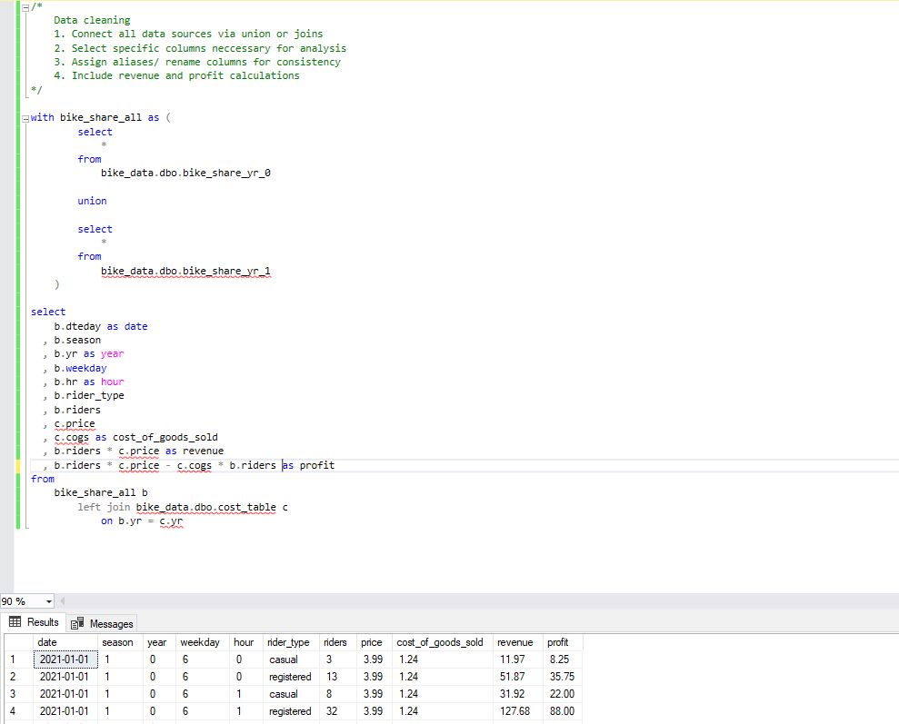

# Toman Bike Share - Data Project


# Table of Contents
- [Business Case](#business-case)
- [Objective](#objective)
  - [Target Audience](#target-audience)
  - [Deadline](#deadline)
- [User Story](#user-story)
  - [Acceptance Criteria](#acceptance-criteria)
  - [Success Criteria](#success-criteria)
- [Data Source](#data-source)
  - [Data Quality Checks](#data-quality-checks)
- [Stages](#stages)
- [Design](#design)
  - [Dashboard Components](#dashboard-components)
  - [Dashboard Mockup](#dashboard-mockup)
  - [Tools](#tools)
- [Development](#development)
  - [Initial Data Exploration](#initial-data-exploration)
  - [Data Cleaning](#data-cleaning)
  - [Data Cleaning Steps](#data-cleaning-steps)
- [Data Testing](#data-testing)
- [Visualization](#visualization)
  - [Power BI Dashboard](#power-bi-dashboard)
  - [DAX Measures](#dax-measures)
- [Analysis](#analysis)
  - [Findings](#findings)
  - [Validation](#validation)
  - [Discovery](#discovery)
- [Recommendations](#recommendations)
  - [Potential ROI](#potential-roi)
  - [Action Plan](#action-plan)


# Business Case

Email Request, Request for Development of Toman Bike Share Dashboard : <br>

Dear Data Analyst, <br>

We need your expertise to develop a dashboard for “Toman Bike Share” that displays our key performance metrics for informed decision-making. <br>


# Objective

The Chief Financial Officer (CFO) David wants to determine whether Toman Bike Share needs to adjust their prices in the following fiscal year. <br>


How will we help (CFO) David determine price adjustments for the next year?

- We will employ 2021 and 2022 Toman Bike Shop data to create a dashboard and draw insights to provide recommendations.
  

The Toman Bike Shop data includes : 

- Date
- Season
- Year, Month, Weekday, Hour
- Rider Type
- Number of Riders (customers)
- Price(s)
- Cost of Goods Sold

We will clean, test, and analyze this data to provide insights and recommendations for price adjustments (if needed) for the following year.


### Target Audience 

Who are we supporting with this assignment? 

- Primary : CFO David
- Secondary : the financial team working under CFO David


### Deadline 

When should we have this project completed?

- We need a preliminary version ASAP
- We have a 2 week timeline to provide feasible recommendations


# User Story 

As the CFO of Toman Bike Share, I want to utilize revenue and demographic trend data to help guide price adjustments for the next year. With the adjustment of our prices, we aim to maximize profit. 


### Acceptance Criteria

The dashboard should include : 

- Profit and Revenue Trends
- Hour Revenue Information
- Seasonal Revenue 
- Ride Demographics
- Color-coded to reflect company colors
- Be user-friendly and easy to filter/ sort 
- Use the most recent data possible


### Success Criteria 

CFO David can : 

- Easily identify what price adjustments are needed for the following year based on the analysis and metrics above
- Assess potential for increased profits based on price adjustments, and
- Make informed decisions while collaborating with the financial team

This will allow CFO David to make the accurate judgment call for price adjustments to maximize profits in the following year.


# Data Source 

What information is needed to achieve our objective? 

- Hourly Revenue
- Total Profits
- Total Revenue
- Total Seasonal Revenue
- Rider Type 
- Number of Riders


What data is needed? 

| Column Name | Data Type |
| --- | --- |
| date | DATE | 
| season | INTEGER |
| year | INTEGER | 
| weekday | INTEGER | 
| hour | INTEGER  | 
| rider_type | NVARCHAR(50) |
| riders | INTEGER | 
| price | MONEY | 
| cogs | INTEGER | 
| revenue | MONEY | 
| profit | MONEY |


### Data Quality Checks

We need to add measures in place to confirm the dataset contains the data required without any issues - here are some of the data quality checks we need to conduct : 

- Column Count Check
- Duplicate Check
- Null Values Check
- Data Validity Check


# Stages

- Design
- Development
- Testing
- Analysis
- Recommendations


# Design

### Dashboard Components

1. What is the percentage change in price from 2021 to 2022?
2. What is the percentage change in customers from 2021 to 2022?
3. During what hours of the day is most profitable - top 5?
4. Which weekdays are most profitable - top 3?
5. Which seasons yield the most profit?
6. Which months out of the year are most profitable - top 5?
7. What is the difference between revenue and profit in 2021 and 2022?
8. Did the price change from 2021 to 2022 influence the rider demographic?
9. What is the price elasticity of demand?


### Dashboard Mockup

What will the components of the dashboard look like? 

1. Matrix
2. Line and Clustered Column Chart
3. Clustered Bar Chart
4. Donut Chart
5. Scorecards
6. Slicer


### Tools 

| Tool | Purpose |
| --- | --- |
| Excel | Exploring the data |
| SQL Server | Cleaning, testing, and analyzing the data |
| Power BI | Visualizing the data via interactive dashboards |
| GitHub | Hosting the project documentation and version control |
| Mokkup AI | Designing the wireframe/mockup of the dashboard | 


# Development 

Stages of development : 

1. Collect 2021-2022 Toman Bike Share Data
2. Explore data on Excel
3. Import data into SQL Server Management Studio
4. Create a database for the Toman Data
5. Clean the data w/ SQL
6. Test the data w/ SQL
8. Import into Power BI for visualiztion
9. Create DAX measures and Power BI Dashboard
11. Generate findings based on insights
12. Provide recommendations to stakeholder
13. Publish the data to GitHub Pages


### Initial Data Exploration

Initial Observations : 

1. Since we are analyzing based on date, demographic, and profit - we will need these columns : date, season, month, year, hour, weekday, rider_type, riders, price, and cogs.
2. The date column has dates set as DD-MM-YYYY so we need to change it to show MM-DD-YYYY.
3. We will need to check for any null values during the data cleaning process.
4. We will need to join union and join the 3 different datasets.
5. We will need to do calculations for the revenue and profits.


### Data Cleaning

What should the data look like once we clean it?

We are aiming to refine the data and select only data that is necessary for our analysis. The constraints are the following : 

- date, season, month, year, hour, weekday, rider_type, riders, price, and cogs columns
- All data types are appropriate
- No null values or unknown values
- Date format should be reconfigured to MM-DD-YYYY from DD-MM-YYYY
- The three datasets are joined together to make one single dataset which include revenue and profit, and
- We apply proper aliasing/ renaming 


Sample of an appropriately cleaned dataset : 

| date | season | year | weekeday | hour | rider_type | riders | price | cost_of_goods_sold | revenue | profit |
| --- | --- | --- | --- | --- | --- | --- | --- | --- | --- | --- |
| 12-09-2022 | 3 | 1 | 3 | 18 | registered | 886 | 4.99 | 1.56 |  4421.14 | 3038.98 |
| 09-20-2022 | 3 | 1 | 4 | 17 | registered | 885 | 4.99 | 1.56 |  4416.15 | 3035.55 |
| 09-26-2022 | 4 | 1 | 3 | 17 | registered | 876 | 4.99 | 1.56 |  4371.24 | 3004.68 |
| 10-24-2022 | 4 | 1 | 3 | 17 | registered | 876 | 4.99 | 1.56 |  4371.24 | 3004.68 |


And here is a tabular representation of the expected schema for the clean data: 

| Column Name | Data Type | Nullable |
| --- | --- | --- |
| date | DATE | NO |
| season | INTEGER | NO |
| year | INTEGER | NO |
| weekday | INTEGER | NO |
| hour | INTEGER  | NO |
| rider_type | NVARCHAR(50) | NO |
| riders | INTEGER | NO |
| price | MONEY | NO |
| cogs | INTEGER | NO |
| revenue | MONEY | NO |
| profit | MONEY | NO |


### Data Cleaning Steps

1. Remove unnessary columns by selecting the columns needed for analysis
2. Change date format for the date column
3. Union and join the tables
4. Create a revenue and profit column
5. Rename columns using aliases


#### Transform the data 


```sql
/*
	Data cleaning 
	1. Connect all data sources via union or joins
	2. Select specific columns neccessary for analysis
	3. Assign aliases/ rename columns for consistency
	4. Include revenue and profit calculations
*/

with bike_share_all as (
		select
		    *
		from
		    bike_data.dbo.bike_share_yr_0

		union 

		select
		    *
		from
		    bike_data.dbo.bike_share_yr_1
	)

select
    b.dteday as date
  , b.season
  , b.yr as year
  , b.weekday
  , b.hr as hour
  , b.rider_type
  , b.riders
  , c.price
  , c.cogs as cost_of_goods_sold
  , b.riders * c.price as revenue
  , b.riders * c.price - c.cogs * b.riders as profit
from	
    bike_share_all b
	  left join bike_data.dbo.cost_table c
		on b.yr = c.yr

```




# Data Testing

What are we testing for? 


High Quality Data Set - data that is complete and accurate, not missing records or inaccurate data : 

- make sure our stakeholders can make accurate decisions based on this data
  

In order to make sure this is true, and we do have high quality data sets, we need to run different tests : 

Data Quality Tests : 

- Column Count Check
- Duplicate Check
- Null Values Check
- Data Validity Check


Expectations : 

| Test | Results | 
| --- | --- |
| Column Count Check | 11 |
| Duplicate Check | 0 | 
| Null Values Check | 0 | 
| Data Validity Check | Correct | 


#### Column Count Check

```sql
/*
	Column count check (PASSED!!!)
	1. Ensure that there are 11 unqiue columns being used
*/

with bike_share_all as (
		select
		    *
		from
		    bike_data.dbo.bike_share_yr_0

		union 

		select
		    *
		from
		    bike_data.dbo.bike_share_yr_1
	), 

bike_data_column_count as (
		select
	            b.dteday as date
		  , b.season
		  , b.yr as year
		  , b.weekday
		  , b.hr as hour
		  , b.rider_type
		  , b.riders
		  , c.price
		  , c.cogs as cost_of_goods_sold
		  , b.riders * c.price as revenue
		  , b.riders * c.price - c.cogs * b.riders as profit
		from	
		    bike_share_all b
			 left join bike_data.dbo.cost_table c
				on b.yr = c.yr
	)

select
    count(*) as column_count
from
    information_schema.columns
where
    1=1
    and table_name = 'bike_data_column_count'

```


#### Duplicate Check

```sql
/*
	Duplicate Check (PASSED!!!)
	1. We used union to remove all duplicates (if there were any)
*/

select
	a.row_count_1 + b.row_count_2 as total_row_count
from	
	(select
	      count(*) row_count_1
	from
	      bike_data.dbo.bike_share_yr_0) a,
	(select
	      count(*) row_count_2
	from
	      bike_data.dbo.bike_share_yr_1) b


select
	count(*) as total_row_count_dup_removed
from
	(  select
		*
	   from
		bike_data.dbo.bike_share_yr_0

	union 

	   select
		*
	   from
		bike_data.dbo.bike_share_yr_1
		) a

```


#### Null Value Check

```sql
/*
	Null Value Check (PASSED!!!)
	1. Check to see if there are any null values in our datset
*/

with bike_share_all as (
		select
		    *
		from
		    bike_data.dbo.bike_share_yr_0

		union 

		select
		    *
		from
		    bike_data.dbo.bike_share_yr_1
	)

select
    b.dteday as date
  , b.season
  , b.yr as year
  , b.weekday
  , b.hr as hour
  , b.rider_type
  , b.riders
  , c.price
  , c.cogs as cost_of_goods_sold
  , b.riders * c.price as revenue
  , b.riders * c.price - c.cogs * b.riders as profit
from	
    bike_share_all b
	 left join bike_data.dbo.cost_table c
		on b.yr = c.yr
where
	1=1
	and b.dteday is null
	or b.season is null
	or b.yr is null
	or b.weekday is null
	or b.hr is null
	or b.rider_type is null
	or b.riders is null
	or c.price is null
	or c.cogs is null

```


#### Data Validity Check

```sql
/*
	Revenue and profit validation check (PASSED!!!)
	1. Use a calculator to see if the calculations are accurate for 5-10 rows
*/

with bike_share_all as (
		select
		    *
		from
		    bike_data.dbo.bike_share_yr_0

		union 

		select
		    *
		from
		    bike_data.dbo.bike_share_yr_1
	)

select
    b.riders
  , c.price
  , c.cogs as cost_of_goods_sold
  , b.riders * c.price as revenue
  , b.riders * c.price - c.cogs * b.riders as profit
from	
    bike_share_all b
	   left join bike_data.dbo.cost_table c
		  on b.yr = c.yr

```


# Visualization


### Power BI Dashboard Results


### DAX Measures

#### 1. Net Profit Margin

```sql
Net Profit Margin = 
VAR sumofrevenue = sum(Query1[revenue])
VAR sumofprofit = sum(Query1[profit])
VAR profitmargin = divide(sumofprofit, sumofrevenue)

RETURN profitmargin

```

# Analysis

## Findings

For this analysis, we will be focusing on the questions below : 

Here are the questions we need to answer for CFO David : 

1. What is the percentage change in price from 2021 to 2022?
2. What is the percentage change in customers from 2021 to 2022?
3. During what hours of the day is most profitable - top 5?
4. Which weekdays are most profitable - top 3?
5. Which seasons yield the most profit?
6. Which months out of the year are most profitable - top 5?
7. What is the difference between revenue and profit in 2021 and 2022?
8. Did the price change from 2021 to 2022 influence the rider demographic?
9. What is the price elasticity of demand?


#### 1. What is the percentage change in price from 2021 to 2022?

Perecentage change in price from 2021 to 2022 = 25%

#### 2. What is the percentage change in customers from 2021 to 2022?

Percentage change in customers from 2021 to 2022 = 100%

#### 3. During what hours of the day is most profitable - top 5?

8AM, 4-7PM are the most profitable hours of the day

Actual hours - 
- 8, 16, 17, 18, 19

#### 4. Which weekdays are most profitable - top 3?

- Thursday
- Friday
- Saturday

#### 5. Which seasons yield the most profit?

In both 2021 and 2022, the order of profitability based on seasons is as follows: 

1. Fall
2. Summer
3. Winter
4. Spring

#### 6. Which months out of the year are most profitable - top 5?

The most profitable months out of the year are September, Augst, July, June, May

Month numbers : 9, 8, 7, 6, 5

#### 7. What is the difference between revenue and profit in 2021 and 2022?

Revenue :

Revenue difference = $5,267,403.00 <br>
Percentage difference in revenue = 106.2% <br>

Profit :
Profit difference = $3,611,512.00 <br>
Percentage difference in profit = 105.56% <br>


#### 8. Did the price change from 2021 to 2022 influence the rider demographic?

The demographic shifted 1.7% from casual to registered customers, the price adjustment did not significantly impact customer demographic 


#### 9. What is the price elasticity of demand?

Price Elasticity of demand = 4.0


### Notes 

For this analysis, we prioritized analyzing metrics that directly impacted profit for this price adjustment analysis. The analysis we will do include : 

1. Revenue and profit analysis
2. Seasonal revenue analysis
3. Rider demographic analysis


## Validation


### 1. Revenue and Profit Analysis

#### Calculation Breakdown

2021 :

- price = $3.99
- COGS = $1.24
- riders = 1,243,103

2022 :

- price = $4.99
- COGS = $1.56
- riders = 2,049,576

Price change from 2021 to 2022 = 25%

a. 2021

- Net Revenue = price * riders = $3.99 * 1,243,103 =  $4,959,981 
- Net Profit = Net Revenue - (COGS * riders) = $4,959,981 - ($1.24 * 1,243,103) = $3,418,533 
- Change in revenue = (new revenue - old revenue) / old revenue = 0
- Change in profit = (new profit - old profit) / old profit = 0

b. 2022

- Net Revenue = price * riders = $4.99 * 2,049,576 = $10,227,384 
- Net Profit = Net Revenue - (COGS * riders) = $10,227,384  - ($1.56 * 2,049,576) = $7,030,046 
- Change in revenue = (new revenue - old revenue) / old revenue = ($10,227,384 - $4,959,981) / $4,959,981 = 106.2%
- Change in profit = (new profit - old profit) / old profit = ($7,030,046 - $3,418,533) / $3,418,533 = 105.6%

**With a 25% increase in the price, we see 105.6% increase in profit**


#### SQL query

```sql
/*
	Revenue and Profit Analysis
	1. Query to find riders count for each individual year (2021, 2022)
	2. Delcare variables
	2. Calculate net revenue = price * riders
	3. Calculate net profit = net revenue - cogs
	4. Calculate change in revenue = Nr - Or/ Or
	5. Calculate change in profit = Np - Op/ Op
*/

declare @2021price money = 3.99; -- price in 2021
declare @2022price money = 4.99; -- price in 2022
declare @2021COGS money = 1.24; -- cogs in 2021
declare @2022COGS money = 1.56; -- cogs in 2022
declare @2021riders int = 1243103; -- rider count in 2021
declare @2022riders int = 2049576; -- rider count in 2022


with bike_share_all as (
		select
		    *
		from
		    bike_data.dbo.bike_share_yr_0

		union 

		select
		    *
		from
		    bike_data.dbo.bike_share_yr_1
	)

select
    @2021price * @2021riders as net_revenue_2021
  , @2022price * @2022riders as net_revenue_2022
  , (@2021price * @2021riders) - (@2021COGS * @2021riders) as net_profit_2021
  , (@2022price * @2022riders) - (@2022COGS * @2022riders) as net_profit_2022
  , ((@2022price * @2022riders) - (@2021price * @2021riders))/ (@2021price * @2021riders)  as perc_change_in_rev
  , (((@2022price * @2022riders) - (@2022COGS * @2022riders)) - ((@2021price * @2021riders) - (@2021COGS * @2021riders)))/ ((@2021price * @2021riders) - (@2021COGS * @2021riders)) as per_change_in_prof
from	
    bike_share_all b
          left join bike_data.dbo.cost_table c
                on b.yr = c.yr

```

#### Output


#### Excel Analysis Workbook


### 2. Seasonal revenue analysis

#### Calculation Breakdown

| ID | Season | 
| --- | --- | 
| 1 | Spring |
| 2 | Summer | 
| 3 | Fall | 
| 4 | Winter | 

a. Spring

2021 Spring Revenue = $600,000 <br>
2022 Spring Revenue = $1,6000,000 <br>
**Total Spring Revenue = $2,200,000**

b. Summer

2021 Summer Revenue = $1,390,000 <br>
2022 Summer Revenue = $2,850,000 <br>
**Total Summer Revenue = $4,240,000**

c. Fall

2021 Fall Revenue = $1,670,000 <br>
2022 Fall Revenue = $3,200,000 <br>
**Total Fall Revenue = $4,870,000**

d. Winter

2021 Winter Revenue = $1,300,000 <br>
2022 Winter Revenue = $2,570,000 <br>
**Total Winter Revenue = $3,870,000**

**Fall yields the highest revenue in general, followed by summer, winter and then spring**

#### SQL query

```sql
/*
	Seasonal Revenue Analysis
	1. Create a case statement to declare specific id's to season
	2. Calculate revenue for all seasons
	3. Pull the sum of the revenue, grouped by both season and year
*/

with bike_share_all as (
		select
		    *
		from
		    bike_data.dbo.bike_share_yr_0

		union 

		select
		    *
		from
		    bike_data.dbo.bike_share_yr_1
	),

seasons as (
		select
		    case when b.season = 1 then 'spring'
		         when b.season = 2 then 'summer'
			 when b.season = 3 then 'fall'
			 else 'winter'
			 end
			as season
		  , substring(cast(b.dteday as varchar(50)), 1, 4) as year
		  , b.riders * c.price as revenue

		from	
		    bike_share_all b
			  left join bike_data.dbo.cost_table c
				on b.yr = c.yr
	)

select
    s.season
  , s.year
  , round(sum(s.revenue), -4) as total_revenue
from
    seasons s
group by
    s.year
  , s.season
order by 
    s.year
  , s.season 


```

#### Output


#### Excel Analysis Workbook


### 3. Rider demographic analysis

#### Calculation Breakdown


2021 : 
Casual Riders = 247,252 (19.89%) <br>
Registered Riders = 995,851 (80.11%) <br>
Total Riders = 1,243,104

2022 : 
Casual Riders = 372,765 (18.19%) <br>
Registered Riders = 1,676,811 (81.81%)  <br>
Total Riders = 2,049,576

a. % change in casual riders 
(2022 causual rider % - 2021 casual rider %) / 2021 casual rider % = (18.19% - 19.89%) / 19.89% = -9%

b. % change in registered riders 
(2022 registered rider % - 2021 registered rider %) / 2021 registered rider % = (81.81% - 80.11%) / 80.11% = 2%

**Price adjustment did not impact riders demographic significantly**

#### SQL query

```sql
/*
	Rider Demographic Analysis
	1. Idenitfy the variables/ columns we need to use
	2. Calculate total riders grouped by year and rider type
*/

with bike_share_all as (
		select
		    *
		from
		    bike_data.dbo.bike_share_yr_0

		union 

		select
		    *
		from
		    bike_data.dbo.bike_share_yr_1
	), 

riders as (
		select
		    substring(cast(b.dteday as varchar(50)), 1, 4) as year
		  , b.rider_type
		  , b.riders
		from	
		    bike_share_all b
			  left join bike_data.dbo.cost_table c
				on b.yr = c.yr
	)
		select
		    r.year
		  , r.rider_type
		  , sum(r.riders) as total_riders
		from						
		    riders r
		group by
		    r.year
		  , r.rider_type

```

#### Output


#### Excel Analysis Workbook


## Discovery

What did we discover? 

1. With a price adjustment from 3.99 in 2021 to 4.99 in 2022, there was an :
- Increase in users by 199% - 1M to 2M
- Both revenue and profit increased by 106% +
2. Fall was the most profitable season, followed up by summer, winter, and fall
3. The rider demographic did not change significantly with the new adjusted price in 2022


# Recommendations

1. If the goal is to maximize profits, then a price increase yields a net positive, therefore a conservative increase in price by 10-15% will yield higher profits without risking significant customer loss.
- 10% increase from $4.99 = $5.49
- 15% increase from $4.99 = $5.74
3. Price adjustments don't have a strong impact on seasonal profits - profits are linear in regards to seasons, so this may be an indicator for an alternative adjustment.
4. Rider demographic is also not strongly impacted by price changes, so segmented pricing strategy or an incentive program may be better.

### Potential ROI

Price Elasticity = change in demand/ change in price = 100%/ 25% = 4 

We have a price elasticity of 4, meaning, when price is increased by 25% - there is a 100% increase in demand. We don't know where the fall off is - so a 10-15% increase in price is conservative enough to yield higher profits while mitigating potential loss in customers.

### Action Plan

Based on our analysis, we can comfortably increase prices by 10-15% in order to increase profits for the next year. <br>

We will reach out the CFO David and the financial team provide our recommendation for a conservative 10% to test the market, and if the feedback is positive - we can move forward with additional price adjustments. <br>

We can also recommend an implementation of price adjustments based on rider demographic - meaning, charging two different prices for the two demographics of casual and registered users because price sensitivity may vary between the two. 


Steps to take in order to implement the recommended decisions effectively :
1. Reach out to CFO David to process price adjustments for the next year
2. Actively monitor user levels, revenue and profit post price adjustment
3. If the user based responds positively to the price adjustment, then look for a more aggressive price increase
4. Review, and if we have a net positive, move onto different price adjustments for demographic types


